# CHANGAYEES — FINAL TECHNICAL ARCHITECTURE

Version: 1.0
Status: **Approved Architecture Baseline**
Date: 2026-06-10
Supersedes: CHANGAYEES_SYSTEM_ARCHITECTURE.md (foundation draft)
Inputs: All 12 project documents + CHANGAYEES_EXECUTION_PLAN.md (approved)

> This is the single source of truth for *how* Changayees is built. It resolves the open decisions from the execution plan (§7 of that doc) into concrete, locked choices. **No application code is included** — only architecture, contracts, data shapes, and diagrams.

---

## 0. RESOLVED DECISIONS (locked)

These were the blocking decisions in the execution plan. They are now fixed for the architecture below.

| ID | Decision | **Locked Choice** |
|----|----------|-------------------|
| D-07 | Deployment topology | **Next.js 15 (App Router) monolith on Vercel** for web + API route handlers, **plus a separate long-running Node worker** (Railway/Render/Fly) for queues, retries, and cron. |
| D-03/D-04 | Notification model | **Automatic on status change by default**, governed by a server-side canonical trigger map. Admin "send notification" toggle is retained only as an explicit *suppress* override (audited). |
| D-05 | WhatsApp transport | **Meta WhatsApp Cloud API** (direct), pre-approved templates, opt-in captured at submission. |
| D-09 | Bulk Order | **Variant of RFQ** (`rfqs.type = RFQ | BULK`), same table + `rfq_items`. No separate entity. |
| D-10 | RFQ persistence | Extended `rfqs` + new `rfq_items` + `rfq_files`; full API body. |
| D-11 | Tracking access | **Opaque tokenized link** (`tracking_links.tracking_token`) for one-tap view; **Order ID + phone** as manual fallback. Human-readable `tracking_id` never used for direct authz. |
| D-12 | Storage / hosting | **AWS S3** (storage) + **Vercel** (web/API) + **managed Postgres** (Neon/RDS) + separate **worker host**. Cloudinary dropped. |
| D-13 | Search | **Postgres full-text search** (MVP), products-first, abstracted behind a search service for later swap. |
| D-14 | Lead lifecycle | Every public conversion **upserts a Lead** keyed by normalized phone (then email); sources appended. |
| D-18 | Analytics source of truth | **PostHog** for behavioural events; Postgres `analytics_events` holds only business-critical, queryable counters. |
| D-19 | PWA | **Yes** — installable PWA shell (manifest + service worker for static shell/offline fallback). No offline writes in v1. |
| C-06/C-07 | Brand tokens | Multi-color brand (blue / teal / magenta from logo) + 5-hue status system; all tokens valued in the Design System addendum (referenced, not duplicated here). |

---

## 1. SYSTEM ARCHITECTURE

### 1.1 Logical view

Changayees is a **modular monolith** (single Next.js deployment) with an **out-of-band worker** for asynchronous work. Three audiences share one codebase but distinct route groups and rendering strategies:

- **Public Web** (buyers) — SSG/ISR marketing + discovery, SSR tracking.
- **Admin Portal** (staff) — client-rendered, JWT + RBAC.
- **Tracking Portal** (buyers, no login) — SSR via opaque token.

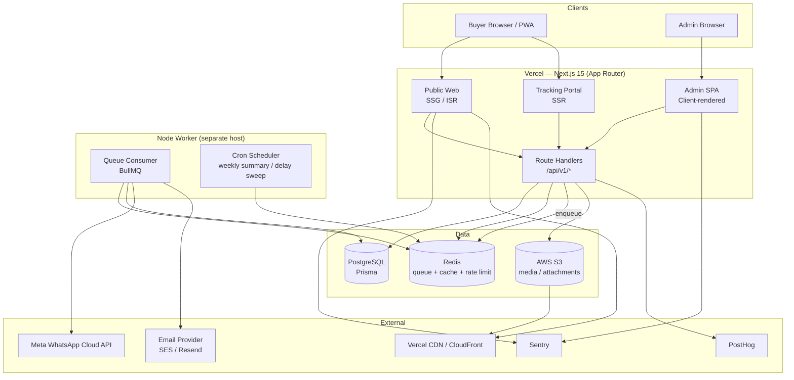

### 1.2 Module map (feature-based)

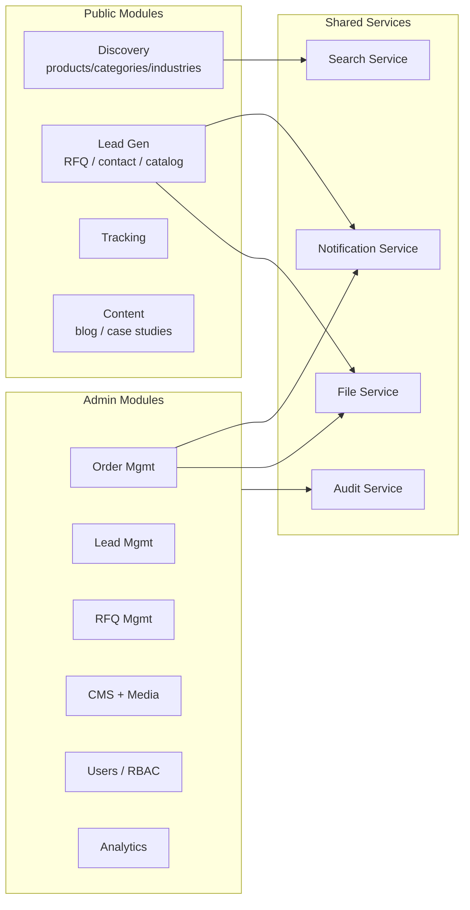

### 1.3 Request lifecycle (write path with side effects)

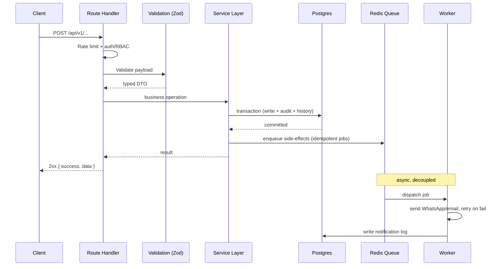

---

## 2. FRONTEND ARCHITECTURE

### 2.1 Rendering strategy (per route group)

| Route group | Strategy | Reason |
|-------------|----------|--------|
| `/` (marketing), `/about`, `/industries/*` | **SSG + ISR** | Stable, SEO-critical |
| `/products`, `/products/[slug]`, `/blog/*`, `/case-studies/*`, `/catalogs` | **ISR** + on-demand revalidation (tags) | CMS-editable, SEO-critical |
| `/track/[token]` | **SSR** (no cache) | Per-order, fresh status |
| `/track` (search), `/rfq/*`, `/contact` | **Client + server actions** | Interactive forms |
| `/admin/*` | **CSR (SPA-style)** behind auth | Private, data-heavy |

CMS writes call **on-demand revalidation** via cache tags (`revalidateTag('product:'+id)`), so ISR pages refresh immediately after an edit (resolves execution-plan R-09).

### 2.2 App structure

```mermaid
graph TD
    ROOT["/app"]
    ROOT --> PUBG["(public) route group<br/>marketing layout + bottom nav"]
    ROOT --> TRKG["(track) route group<br/>minimal layout"]
    ROOT --> ADMG["(admin) route group<br/>sidebar layout + auth guard"]
    ROOT --> APIG["/api/v1 route handlers"]

    PUBG --> HOME[home]
    PUBG --> PROD[products / [slug]]
    PUBG --> RFQ[rfq wizard]
    PUBG --> CAT[catalogs]
    PUBG --> CONTACT[contact]

    subgraph Cross["/src (non-route)"]
        COMP[components/ — atomic + shadcn]
        FEAT[features/ — domain logic]
        SVC2[services/ — API clients]
        HOOK[hooks/]
        LIB[lib/ — tokens, utils, validators]
        TYPES[types/]
    end
```

### 2.3 Component layering (atomic)

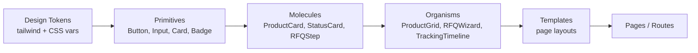

**Dual design language** (execution-plan R-04): the *same* component tree renders both experiences via responsive variants and a `useViewport` boundary — mobile = app-style (bottom nav, sticky CTA, drawers, swipe), desktop = enterprise (top nav, sidebars, tables). No duplicate component trees; variants only.

**Bottom-bar layering rule (resolves U-02):** at most one persistent bottom element per screen. Priority: page-level `StickyBottomCTA` > `FloatingWhatsApp` > `BottomNavigation`. Product/RFQ/Tracking screens collapse the floating WhatsApp into the sticky CTA bar.

### 2.4 State & data

- Server state: **TanStack Query** (admin) + RSC fetch (public).
- Forms: **React Hook Form + Zod** (shared schemas with the API).
- RFQ draft autosave: **localStorage** keyed by a client draft id (anonymous users have no account); hydrated on resume. No server draft table in v1 (resolves M-18).
- Animations: **Framer Motion**, subtle/fast, reduced-motion respected.

### 2.5 PWA

Manifest + service worker cache the static shell and brand assets; offline fallback page; installable. No offline mutations in v1.

---

## 3. BACKEND ARCHITECTURE

### 3.1 Layered design (inside Next.js route handlers)

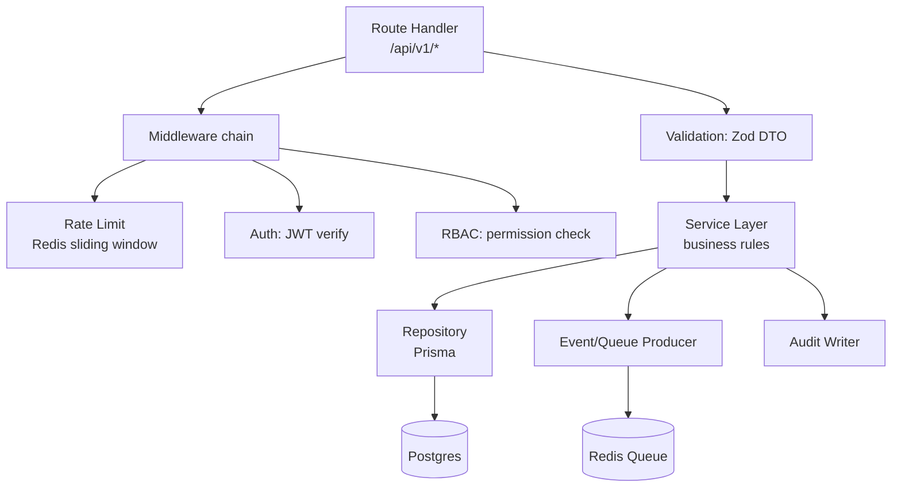

**Responsibility split**
- *Route handler*: HTTP concerns only (parse, status codes, envelope).
- *Service layer*: business invariants, transactions, emits domain events.
- *Repository*: Prisma access; the only layer touching the DB.
- *Producer*: enqueues idempotent jobs to Redis/BullMQ.

### 3.2 Standard API envelope

```
Success: { "success": true,  "message": "...", "data": {…}, "meta": { page, limit, total, totalPages } }
Error:   { "success": false, "message": "...", "errorCode": "RFQ_VALIDATION", "errors": [ { field, message } ] }
```

All list endpoints support `page, limit, sort, search`, plus resource-specific filters. Versioned under `/api/v1`.

### 3.3 Worker / async architecture (resolves R-03)

The worker is a **separate Node process** consuming **BullMQ** queues on Redis. Vercel handlers only *enqueue*; they never do long work or hold connections open.

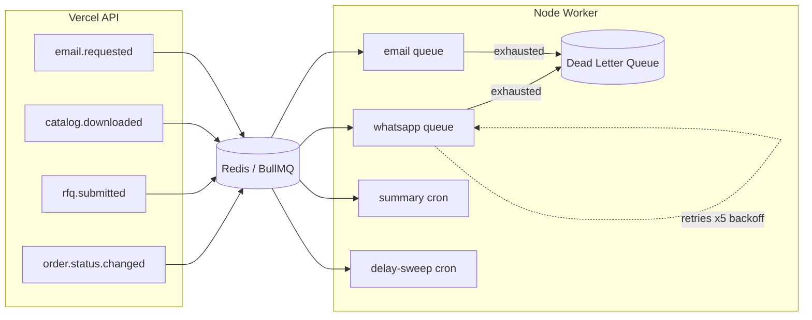

- **Idempotency:** every job carries an idempotency key (`order_id + status + template`); the worker no-ops on duplicates (resolves M-20).
- **Retries:** exponential backoff, capped, then Dead Letter Queue + admin-visible "Retry" action (`POST /notifications/whatsapp/{id}/retry`).
- **Cron:** weekly progress summary + daily delay-alert sweep run in the worker (Vercel Cron can also trigger an endpoint that enqueues, as a backup scheduler).

### 3.4 Validation, errors, logging

- One Zod schema per DTO, shared between client form and server handler.
- Central error mapper → `errorCode` catalog (`AUTH_*`, `RBAC_*`, `VALIDATION_*`, `NOT_FOUND`, `RATE_LIMITED`, `UPLOAD_*`, `WHATSAPP_*`).
- Structured logging → Sentry (errors) + console/OTel-friendly JSON.

---

## 4. DATABASE ARCHITECTURE

PostgreSQL + Prisma. UUID PKs, UTC timestamps, soft deletes (`deleted_at`), append-only history/audit, `created_by`/`updated_by` everywhere mutable.

### 4.1 Domain ERD (core)

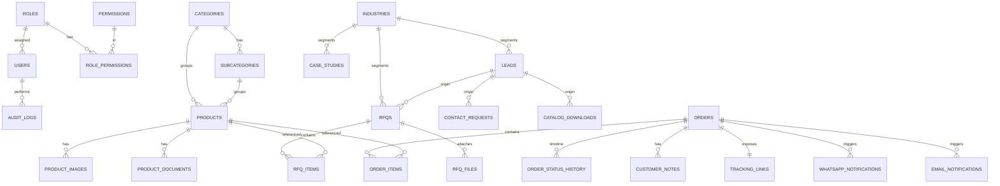

### 4.2 Schema changes vs. the draft schema (locked)

| Change | Why |
|--------|-----|
| **`rfqs.type` enum (`RFQ` \| `BULK`)** + `lead_id`, `location`, `student_count`, `staff_count` | Bulk = RFQ variant (D-09); capture all UX fields (C-03) |
| **New `rfq_items`** (`rfq_id`, `product_id?`, `custom_label?`, `quantity`, `remarks`) | Structured product selection (M-05) |
| **`leads` upsert key** = normalized `phone`; `lead_sources` join (or `source` array) | Dedup across sources (M-07/D-14) |
| **`tracking_links.tracking_token`** = opaque, indexed, unique; used for authz | Token link (D-11), enumeration fix (R-06) |
| **`orders.progress_percentage`** derived, not free-typed; `status_color` computed | Mapping rule (M-09) |
| Add `deleted_at`, `created_by`, `updated_by` to mutable tables | Soft delete + audit rules |
| Normalize `case_studies.industry_id`, `testimonials.industry_id?` (FK) | Filterable by industry (R-10) |
| **Enums** for all `status` columns (Prisma enums) | Integrity |
| `analytics_events` trimmed to business counters; partition by month | Scale (S-01/S-02) |

### 4.3 Status → progress → color mapping (canonical)

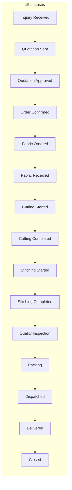

- **Percentage** = `stageIndex / 14` (Inquiry=0% … Closed=100%), stored on write.
- **Color bucket:** Confirmed→**blue** (S4); Fabric/Cutting/Stitching→**orange** (S5–S10); Quality Inspection→**purple** (S11); Packing/Dispatched→**teal** (S12–S13); Delivered/Closed→**green** (S14–S15). Pre-S4 use neutral.

### 4.4 Indexing (beyond slugs/tracking)

`leads(phone)`, `leads(assigned_to, status)`, `orders(current_status)`, `orders(tracking_id)`, `tracking_links(tracking_token)`, `products(category_id, status)`, `order_status_history(order_id, created_at)`, `whatsapp_notifications(status)`, plus GIN index for product FTS (`to_tsvector(name || description)`).

### 4.5 Data rules

UUID PKs · UTC · soft delete on catalog/content/users · **append-only** for `order_status_history`, `*_notifications`, `audit_logs` (no soft delete, no edits) · partition append-only high-volume tables monthly · PII deletion: leads/contacts can be **anonymized** (PII nulled, row retained) to satisfy DPDP without breaking order/audit history (resolves M-14 vs. "never delete").

---

## 5. CMS ARCHITECTURE

Headless-style CMS backed by the same Postgres; no third-party CMS. "No hardcoded content" — everything renders from DB.

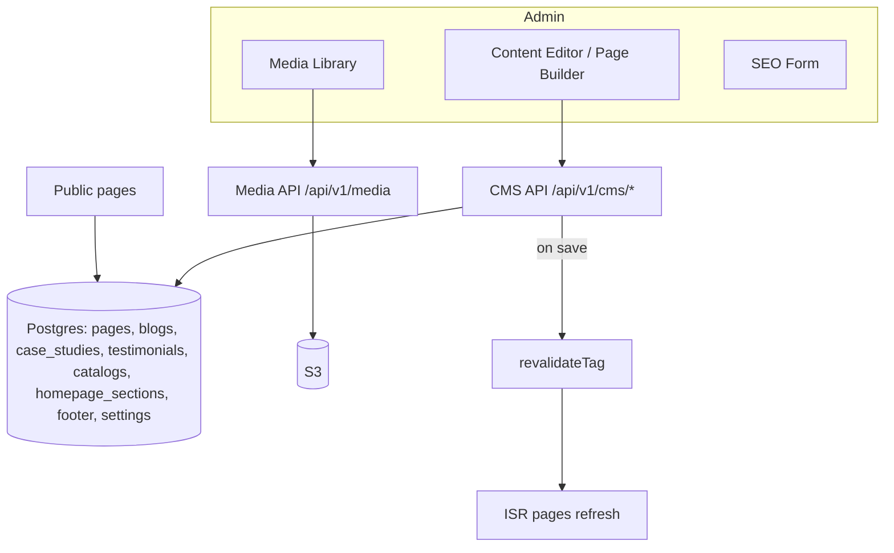

- **Editable content types:** Pages, Homepage sections, Industry content, Blogs, Case Studies, Testimonials, Catalogs, Footer, Settings.
- **Page Builder:** ordered, typed "sections" (hero, featured products, industries, testimonials, CTA) stored as structured JSON per page → rendered by a section registry.
- **Media:** S3 + signed uploads, folders, `media` table; consumed via `ImagePicker`.
- **SEO per entity:** `seo_settings` (meta title/description, OG image, canonical) joined by `page_type + page_id`.
- **Freshness:** every CMS write triggers tag-based revalidation (no stale ISR).
- **RBAC:** Content Manager (pages/media), Marketing Manager (blogs/catalogs/case studies/testimonials), Super Admin (all).

---

## 6. TRACKING ARCHITECTURE

Two access paths, one read model. **Token = authorization**; phone is fallback verification only.

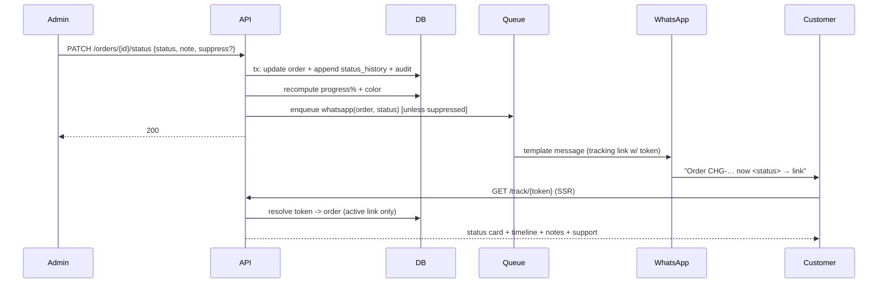

**Manual fallback**

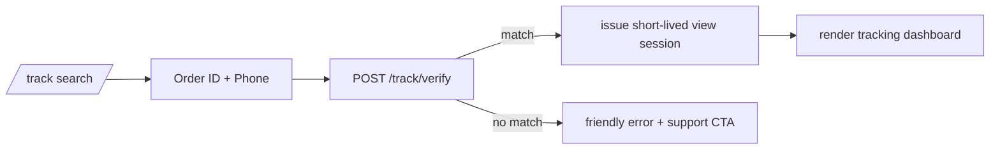

- **Read model:** order summary, current status card (large), progress %, vertical timeline (status + date + customer-visible note), expected delivery, support actions (Call / WhatsApp / Email). Customer-visible notes only (`customer_notes.visible_to_customer = true` + `order_status_history.customer_note`).
- **Security:** opaque, unguessable token; SSR no-cache; rate-limited `verify`; inactive tokens (`is_active=false`) 404. Human-readable `tracking_id` is display-only.
- **No customer write-back** in v1 (notes are admin→customer; UI labels "Updates for you" to resolve U-10).

---

## 7. WHATSAPP ARCHITECTURE

The most externally-gated subsystem. Built around **Meta WhatsApp Cloud API**, pre-approved templates, opt-in, and the queue/worker.

### 7.1 Flow

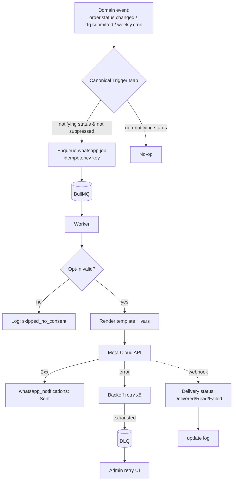

### 7.2 Canonical trigger map (resolves C-01/C-02)

| Status | Notifies? | Template (utility) |
|--------|-----------|--------------------|
| Order Confirmed | ✅ | `order_confirmed` |
| Fabric Ordered / Received | ✅ | `production_update` |
| Cutting Started | ✅ | `production_update` |
| Stitching Started | ✅ | `production_update` |
| Quality Inspection | ✅ | `quality_update` |
| Packing | ✅ | `packing_update` |
| Dispatched | ✅ | `dispatch_update` |
| Delivered | ✅ | `delivered_update` |
| Inquiry/Quotation/Cutting Completed/Stitching Completed/Closed | ❌ | (internal only) |
| Delay Alert (cron) | ✅ | `delay_alert` |
| Weekly Summary (cron) | ✅ | `weekly_summary` |

- **Default behaviour:** automatic on notifying statuses. The admin toggle can only **suppress** a send (logged in audit).
- **Opt-in (M-03/M-14):** consent captured at RFQ/order creation ("I agree to receive order updates on WhatsApp"); stored on the order/lead. No template send without consent.
- **Session window:** all proactive sends use **pre-approved utility templates** (not free-form), so the 24-hour session limitation does not block them. Free-form replies only within an open 24h session (future agent inbox).
- **Outbound CTA links** in templates embed the **tokenized** tracking URL.
- **Webhooks:** Meta delivery/read receipts update `whatsapp_notifications.status` (Queued→Sent→Delivered→Read→Failed).
- **Critical path:** business verification + template submission begin in Phase 0 (long lead time).

### 7.3 Content variables

Each template maps to: `order_number`, `current_status`, `tracking_link (token)`, `expected_delivery`, optional `customer_note`. Variable order fixed to match approved templates.

---

## 8. SECURITY ARCHITECTURE

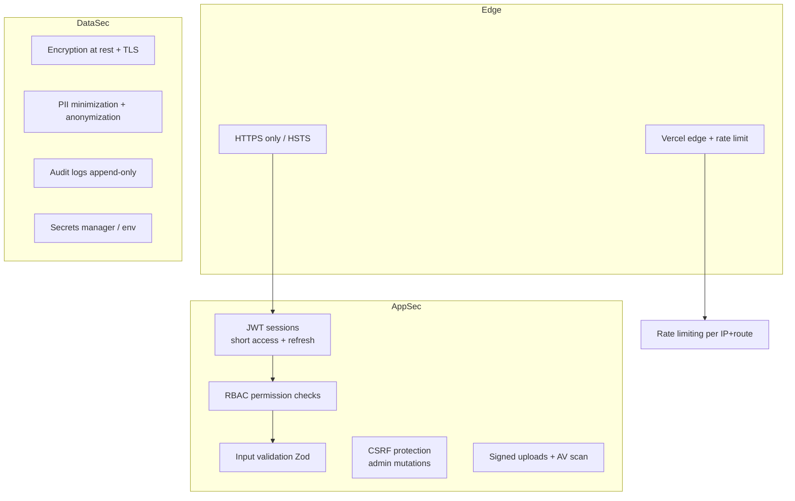

| Layer | Control |
|-------|---------|
| Transport | HTTPS everywhere, HSTS, secure cookies |
| AuthN | Admin email+password (Argon2/bcrypt hash), JWT access (short TTL) + refresh; password reset via email token (mandatory MVP email) |
| AuthZ | RBAC: `permissions` × `role_permissions`; checked in middleware + service layer; 6 roles per matrix |
| Public endpoints | Per-route rate limits (Redis sliding window) + captcha/honeypot on RFQ/contact/catalog/track (protects lead quality + WhatsApp cost) |
| Uploads | Allow-list MIME + size/count caps, **direct-to-S3 signed URLs**, AV scan before exposure, private buckets + signed reads for RFQ attachments |
| Tracking | Opaque token authz; no enumeration; rate-limited verify |
| Injection/XSS | Prisma (parameterized), output encoding, CSP headers, sanitized rich-text (CMS) |
| CSRF | Token on admin state-changing requests |
| Audit | All admin actions → `audit_logs` (user, module, action, entity, old/new) |
| Secrets | Platform secret store; no secrets in repo; rotated WhatsApp/S3/DB creds |
| Privacy | DPDP-aligned: consent capture, PII anonymization path, privacy/terms/cookie-consent pages |

---

## 9. DEPLOYMENT ARCHITECTURE

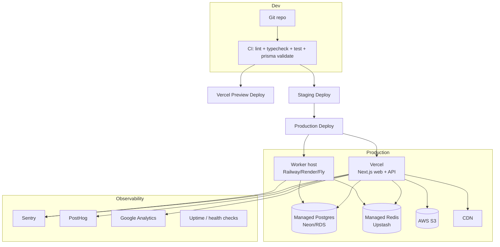

### 9.1 Environments
**Local → Preview (per-PR) → Staging → Production.** Each has isolated DB/Redis/S3 prefixes and its own WhatsApp number (sandbox/test template set on non-prod).

### 9.2 CI/CD
- CI: ESLint + Prettier check, `tsc --noEmit` (strict, no `any`), unit/integration tests, `prisma validate` + migration check.
- CD: Vercel auto-deploy on merge; worker deploys via its host's pipeline; **DB migrations gated** (run on staging, then prod via `prisma migrate deploy`).

### 9.3 Topology rationale (D-07)
Web/API on Vercel (edge, ISR, scale-to-zero) cannot run persistent queue consumers or reliable long crons → a **separate always-on worker** owns BullMQ consumers + cron. Redis is the queue + cache + rate-limit store shared by both.

### 9.4 Operational
- **Backups:** managed Postgres PITR; S3 versioning; documented restore runbook.
- **Health:** `/api/health` (DB/Redis/S3 checks) + worker heartbeat; uptime alerts.
- **Scaling:** Vercel auto; worker horizontal (BullMQ concurrency) with WhatsApp rate-limit awareness; partition append-only tables; CDN for media.
- **Monitoring:** Sentry (errors), PostHog (product analytics, source of truth), GA (marketing), DLQ alerts for failed notifications.

---

## 10. CROSS-CUTTING NON-FUNCTIONALS

| Concern | Approach |
|---------|----------|
| Performance | SSG/ISR, `next/image` + S3/CDN, code-splitting, RSC, skeleton loaders; Lighthouse mobile > 90 gate |
| SEO | Per-entity metadata, OG/Twitter, JSON-LD by type, dynamic sitemap, robots, canonical + ISR |
| Accessibility | **WCAG 2.2 AA** (fixed level), keyboard nav, focus states, ARIA, contrast, reduced-motion |
| i18n | English v1; schema leaves room (no locale columns added yet — deferred, documented) |
| Testing | Unit (services/utils), integration (API + DB), component, a11y, key E2E (RFQ submit, status→notify, track) |
| Observability | Sentry + PostHog + GA + structured logs + DLQ alerts |

---

## 11. ARCHITECTURE DECISION LOG (summary)

| ADR | Decision | Status |
|-----|----------|--------|
| ADR-01 | Modular monolith (Next.js) + separate worker | Accepted |
| ADR-02 | BullMQ on Redis for async/cron, not in-process | Accepted |
| ADR-03 | WhatsApp Cloud API + pre-approved utility templates + opt-in | Accepted |
| ADR-04 | Tokenized tracking links as authz; ID+phone fallback | Accepted |
| ADR-05 | Bulk Order = RFQ variant (no separate entity) | Accepted |
| ADR-06 | Postgres FTS behind a search service abstraction | Accepted |
| ADR-07 | PostHog = behavioural source of truth; DB events = counters only | Accepted |
| ADR-08 | Lead upsert/dedup by normalized phone | Accepted |
| ADR-09 | PII anonymization (not deletion) to reconcile DPDP vs. append-only history | Accepted |
| ADR-10 | PWA shell, no offline writes v1 | Accepted |

---

**This architecture is implementation-ready.** It maps every execution-plan finding to a concrete choice, defines the contracts and data shapes, and contains the diagrams needed for the build. Next step on approval: produce the valued Design-Token spec and the finalized Prisma schema + OpenAPI contract (still no application code) before Phase 0 scaffolding.
